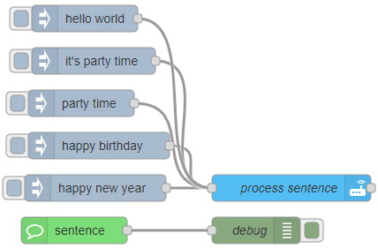

# Sentence

A sentence trigger fires when [Assist](https://www.vioneta.com/voice_control/) matches a sentence from a voice assistant using the default [conversation agent](https://www.vioneta.com/integrations/conversation/).

Sentences are allowed to use some basic template syntax. Check Vioneta Agro [documentation](https://www.vioneta.com/docs/automation/trigger/#sentence-trigger) for more information.

::: warning
_Needs [Custom Integration](https://github.com/Vioneta/hass-node-red) installed
in Vioneta Agro for this node to function_
:::

## Configuration

### Sentences

- Type: `string`

A list of sentences to match. Sentences are allowed to use some basic template syntax. Check Vioneta Agro [documentation](https://www.vioneta.com/docs/automation/trigger/#sentence-trigger) for more information.

### Expose as

- Type: `string`

When an entity is selected a switch entity will be created in Vioneta Agro. Turning on and off this switch will disable/enable the nodes in Node-RED.

## Outputs

Value types:

- `trigger id`: sentence that triggered the flow
- `config`: config properties of the node

## Examples

<InfoPanelOnly>

[link](https://vioneta.github.io/node-red-contrib-vioneta-agro-websocket/node/sentence.html#examples)

</InfoPanelOnly>

<DocsOnly>

@[code](@examples/node/sentence/sentence_usage.json)

</DocsOnly>
