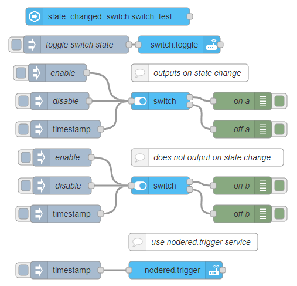

::: warning
_Needs [Custom Integration](https://github.com/Vioneta/hass-node-red) installed
in Vioneta Agro for this node to function_
:::

# Switch

Creates a switch in Vioneta Agro which can be manipulated from this node.

## Configuration

### Enable input

Input is disabled by default. It can be enabled by checking this option.

### Output on state change

- Type: `boolean`

When the state of the switch changes it will output to the top if the switch is on or to the bottom if it is in the off position.

## Inputs

### msg.enable

- Type: `boolean`

Set to `true` to turn on the switch and `false` to turn it off. If the message has a property `enable` defined and set to a `boolean` the node will not have any output.

## Outputs

**Status Color**

- Green/Red: output from the node was due to input to the node
- Blue: output from the node was due to the state of the node changing
- Yellow: state of node changed but no output

## Examples

<InfoPanelOnly>

[link](https://vioneta.github.io/node-red-contrib-vioneta-agro-websocket/node/switch.html#examples)

</InfoPanelOnly>

<DocsOnly>

#### Usage example

@[code](@examples/node/switch/switch_usage.json)

</DocsOnly>
