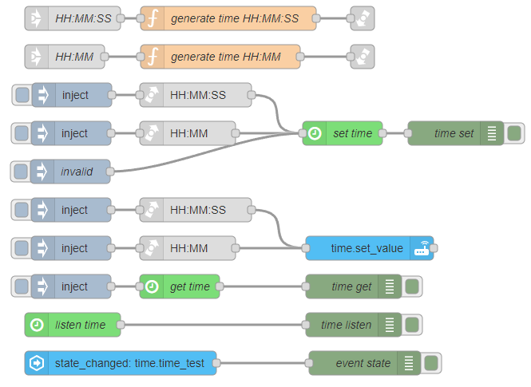

::: warning
_Needs [Custom Integration](https://github.com/Vioneta/hass-node-red) installed
in Vioneta Agro for this node to function_
:::

# Time

Creates a time entity in Vioneta Agro which can be manipulated from this node or Vioneta Agro.

## Configuration

### Mode <Badge text="required"/>

- Type: 'listen' | 'get' | 'set'

The mode of the node

### Value <Badge text="required"/>

- Type: `string`
- Format: `HH:mm:ss` | `HH:mm`

The value of the entity should be updated to

## Inputs

properties of `msg.payload`

### value

- Type: `string`
- Format: `HH:mm:ss` | `HH:mm`

The value of the entity should be updated to

## Outputs

Value types:

- `value`: The value of the entity
- `previous value`: The previous value of the entity
- `config`: The config properties of the node

## Examples

<InfoPanelOnly>

[link](https://vioneta.github.io/node-red-contrib-vioneta-agro-websocket/node/time-entity.html#examples)

</InfoPanelOnly>

<DocsOnly>

#### Usage example

@[code](@examples/node/time-entity/time_usage.json)

</DocsOnly>
